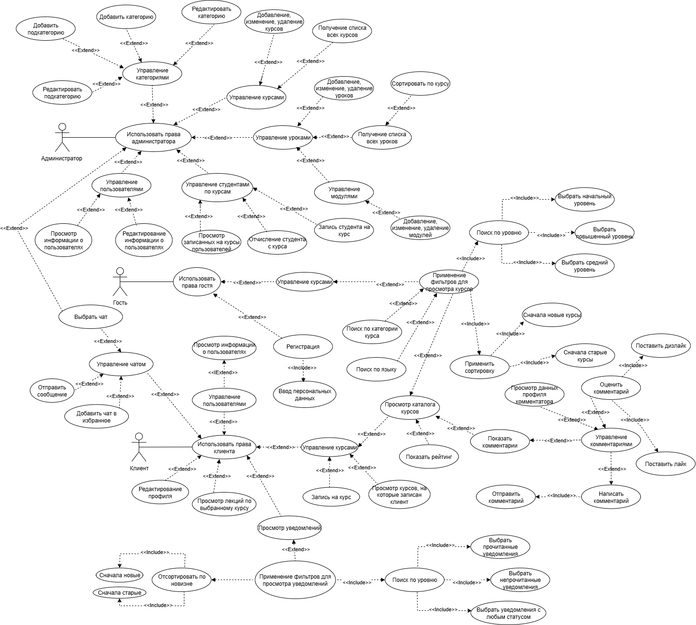
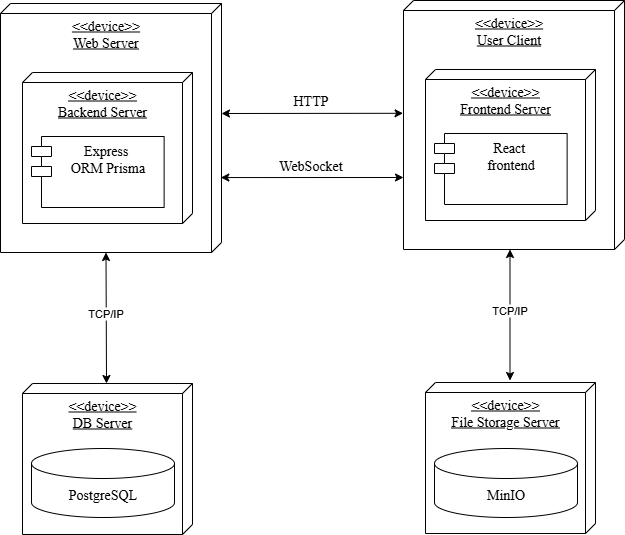
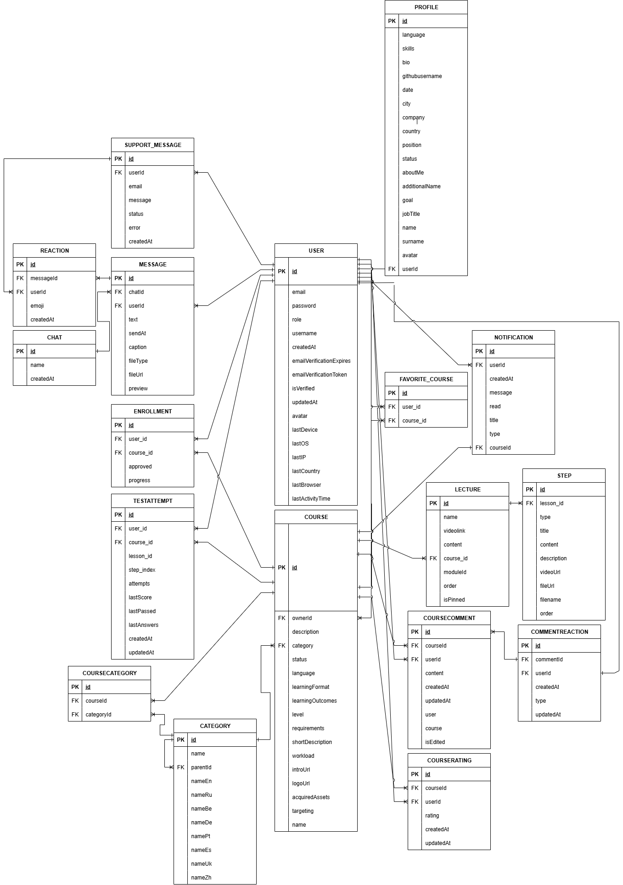

 # Company Courses
 
 Веб‑платформа для размещения и прохождения IT‑курсов.
 
 Проект состоит из:
 
 - **Backend**: Node.js (Express) + Prisma + PostgreSQL, JWT‑аутентификация, хранение файлов в **MinIO**
 - **Frontend**: React приложение
 - **Инфраструктура**: Docker Compose (PostgreSQL + MinIO + backend + frontend)
 
 ## Диаграммы
 
 ### Use Case Diagram
 
 
 
 ### Architecture Diagram
 
 
 
 ### Database Diagram
 
 
 
 ## Быстрый старт (Docker Compose)
 
 Docker‑конфигурация находится в папке `Realization`.
 
 1. Запуск всех сервисов:
 
 ```bash
 docker-compose up -d --build
 ```
 
 2. Проверка статуса:
 
 ```bash
 docker-compose ps
 ```
 
 После запуска будут доступны:
 
 - **Frontend**: http://localhost:3000
 - **Backend**: http://localhost:9000
 - **MinIO (S3 API)**: http://localhost:9075
 - **MinIO Console**: http://localhost:9001
 - **PostgreSQL**: localhost:5433
 
 Дополнительные инструкции по Docker (логи, перезапуск, troubleshooting) есть в `Realization/DOCKER_README.md`.
 
 ## Технологический стек
 
 - **Backend**
   - Node.js 18
   - Express
   - Prisma (`Realization/backend/prisma/schema.prisma`)
   - PostgreSQL
   - MinIO (S3‑совместимое хранилище)
   - JWT (`jsonwebtoken`)
   - OAuth через `passport` (Google/Facebook/Yandex/Dribbble)
   - WebSocket: `socket.io`
   - Email: `nodemailer`
 - **Frontend**
   - React 18 (Create React App)
   - Redux
   - Bootstrap / Reactstrap
   - i18next
 
 ## Основные сущности (по схеме БД)
 
 - **Пользователи и профиль**: `User`, `Profile`
 - **Курсы и категории**: `Course`, `Category`, `CourseCategory`
 - **Обучение**: `Enrollment`, `Lecture`, `Step`, `TestAttempt`
 - **Взаимодействия**: `CourseComment`, `CourseRating`, `FavoriteCourse`, реакции
 - **Коммуникации**: `Chat`, `Message`, `Reaction`, `Notification`, `SupportMessage`
 
 ## Структура репозитория
 
 - `Documentation/` — документация и диаграммы
 - `Realization/` — реализация проекта
   - `backend/` — Node.js API
   - `frontend/` — React приложение
   - `docker-compose.yml` — запуск всей системы
   - `database/`, `testData/` — вспомогательные данные
 
 ## Переменные окружения (важное)
 
 Основные переменные уже заданы в `Realization/docker-compose.yml`. Если запускаете сервисы не через compose, обратите внимание на:
 
 - `DATABASE_URL`
 - `JWT_SECRET`
 - `MINIO_ENDPOINT`, `MINIO_PORT`, `MINIO_ACCESS_KEY`, `MINIO_SECRET_KEY`, `MINIO_BUCKET`
 
 ## Запуск без Docker (локально)
 
 1. Поднимите PostgreSQL и MinIO (можно через Docker Compose).
 2. Backend:
 
 ```bash
 npm install
 npm run dev
 ```
 
 3. Frontend:
 
 ```bash
 npm install
 npm start
 ```
